<!-- ══════════════════════════════════════════════════════════════════════════ -->
<!--                              OM SARDAR                                   -->
<!--                      GitHub Profile README                               -->
<!-- ══════════════════════════════════════════════════════════════════════════ -->

  

   

<samp>Building scalable applications and turning complex problems into elegant solutions</samp>

  

  &nbsp;
  &nbsp;
  &nbsp;
    

  
  &nbsp;
  

<!-- ══════════════════════════════════════════════════════════════════════════ -->
<!--                            NAVIGATION                                    -->
<!-- ══════════════════════════════════════════════════════════════════════════ -->

   
  <a href="#about">About</a>&nbsp;&nbsp;&#8226;&nbsp;&nbsp;
  <a href="#technology-stack">Tech Stack</a>&nbsp;&nbsp;&#8226;&nbsp;&nbsp;
  <a href="#api--integrations">APIs</a>&nbsp;&nbsp;&#8226;&nbsp;&nbsp;
  <a href="#featured-projects">Projects</a>&nbsp;&nbsp;&#8226;&nbsp;&nbsp;
  <a href="#github-analytics">Analytics</a>&nbsp;&nbsp;&#8226;&nbsp;&nbsp;
  <a href="#engineering-mindset">Engineering</a>&nbsp;&nbsp;&#8226;&nbsp;&nbsp;
  <a href="#roadmap">Roadmap</a>&nbsp;&nbsp;&#8226;&nbsp;&nbsp;
  <a href="#connect">Connect</a>
    

---

<!-- ══════════════════════════════════════════════════════════════════════════ -->
<!--                                ABOUT                                     -->
<!-- ══════════════════════════════════════════════════════════════════════════ -->

<h2 align="center" style="font-family: Georgia, serif;" id="about">About</h2>

 

  

 

 

 

---

<!-- ══════════════════════════════════════════════════════════════════════════ -->
<!--                         TECHNOLOGY STACK                                 -->
<!-- ══════════════════════════════════════════════════════════════════════════ -->

<h2 align="center" style="font-family: Georgia, serif;" id="technology-stack">Technology Stack</h2>

<h3 align="center" style="font-family: Georgia, serif;">Core Technologies</h3>

 

<h4 align="center" style="color: #58A6FF;">Programming Languages</h4>

<h4 align="center" style="color: #58A6FF;">Frontend Development</h4>

&nbsp;&nbsp;

<h4 align="center" style="color: #58A6FF;">Backend & Databases</h4>

&nbsp;&nbsp;&nbsp;&nbsp;

<h4 align="center" style="color: #58A6FF;">Java Ecosystem</h4>

&nbsp;&nbsp;&nbsp;&nbsp;

<h4 align="center" style="color: #58A6FF;">Cloud & DevOps</h4>

<h4 align="center" style="color: #58A6FF;">Developer Tools & Testing</h4>

&nbsp;&nbsp;&nbsp;&nbsp;

 

<h2 align="center" style="font-family: Georgia, serif;" id="api--integrations">Libraries & Frameworks</h2>

<table width="100%">
<tr>
<td width="33%" valign="top" align="center">
<h4>Frontend & UI</h4>

</td>
<td width="33%" valign="top" align="center">
<h4>Backend & Middleware</h4>

</td>
<td width="33%" valign="top" align="center">
<h4>Animation & Visualization</h4>

</td>
</tr>
<tr>
<td width="33%" valign="top" align="center">
<h4>Icons & UX</h4>

</td>
<td width="33%" valign="top" align="center">
<h4>Date & PDF</h4>

</td>
<td width="33%" valign="top" align="center">
<h4>Databases</h4>

</td>
</tr>
<tr>
<td width="33%" valign="top" align="center">
<h4>Mobile Development</h4>

</td>
<td width="33%" valign="top" align="center">
<h4>Build & Quality</h4>

</td>
<td width="33%" valign="top" align="center">
<h4>Development Environment</h4>

</td>
</tr>
</table>

---

<!-- ══════════════════════════════════════════════════════════════════════════ -->
<!--                           FEATURED PROJECTS                              -->
<!-- ══════════════════════════════════════════════════════════════════════════ -->

<h2 align="center" style="font-family: Georgia, serif;" id="featured-projects">Featured Projects</h2>

<table width="100%">
<tr>
<td valign="top">

<h3>AuctionX · MERN Auction Application</h3>

An early project I built as my final-year BCA minor project. The codebase includes auction listings and bidding interfaces, account flows, and seller and admin screens.

<strong>Project status:</strong> This public repository contains an earlier learning implementation. Its README documents serious security and correctness issues; do not use it with real accounts, personal data, or payments.

  
<a href="https://github.com/OmSardar/AuctionX-Live-Auction-Platform"><strong>VIEW MINOR-PROJECT SOURCE ↗</strong></a>
&nbsp; · &nbsp;
<a href="https://auction-x-minor-project-2024.onrender.com/"><strong>OPEN MINOR-PROJECT DEMO ↗</strong></a>

  
<a href="https://the-auction-x.onrender.com/"><strong>OPEN ENHANCED VERSION ↗</strong></a>
 The enhanced deployment is a separate build; its source is not public on GitHub yet.

</td>
</tr>
</table>

---

<!-- ═══════════════════════════════════════════════════════════════════════ -->
<!--                           GITHUB ANALYTICS                              -->
<!-- ═══════════════════════════════════════════════════════════════════════ -->

<h2 align="center" style="font-family: Georgia, serif;" id="github-analytics">GitHub Analytics</h2>

  <samp>Live GitHub metrics, development statistics, and contribution activity.</samp>

 

<!-- Profile Overview -->

  

<!-- Contribution Streak -->

  

<!-- Statistics -->

  

<!-- Languages -->

  

 

---

<!-- ══════════════════════════════════════════════════════════════════════════ -->
<!--                       CONTRIBUTION ACTIVITY                              -->
<!-- ══════════════════════════════════════════════════════════════════════════ -->

<h2 align="center" style="font-family: Georgia, serif;" id="contribution-activity">Contribution Activity</h2>

  

##  

<!-- ══════════════════════════════════════════════════════════════════════════ -->
<!--                       ENGINEERING MINDSET                                -->
<!-- ══════════════════════════════════════════════════════════════════════════ -->

<h2 align="center" style="font-family: Georgia, serif;" id="engineering-mindset">Engineering Mindset</h2>

  <samp>Areas I am learning, studying, and building towards ─ not claims of production expertise.</samp>

  

<h3 align="center" style="font-family: Georgia, serif;">System Design Reference</h3>

  

<h3 align="center" style="font-family: Georgia, serif;">Key Areas of Interest</h3>

  

 

<h3 align="center" style="font-family: Georgia, serif;">Engineering Learning Loop</h3>

  

 

<h3 align="center" style="font-family: Georgia, serif;">Development Principles</h3>

  

---

<!-- ══════════════════════════════════════════════════════════════════════════ -->
<!--                             ROADMAP                                      -->
<!-- ══════════════════════════════════════════════════════════════════════════ -->

<h2 align="center" style="font-family: Georgia, serif;" id="roadmap">Roadmap</h2>

  

---

<!-- ══════════════════════════════════════════════════════════════════════════ -->
<!--                          OPEN TO                                         -->
<!-- ══════════════════════════════════════════════════════════════════════════ -->

<h2 align="center" style="font-family: Georgia, serif;" id="open-to">Open To</h2>

  

---

<!-- ══════════════════════════════════════════════════════════════════════════ -->
<!--                            CONNECT                                       -->
<!-- ══════════════════════════════════════════════════════════════════════════ -->

<h2 align="center" style="font-family: Georgia, serif;" id="connect">Connect</h2>

  

  &nbsp;&nbsp;
  &nbsp;&nbsp;
  &nbsp;&nbsp;
    

---

<!-- ══════════════════════════════════════════════════════════════════════════ -->
<!--                             FOOTER                                       -->
<!-- ══════════════════════════════════════════════════════════════════════════ -->

   

